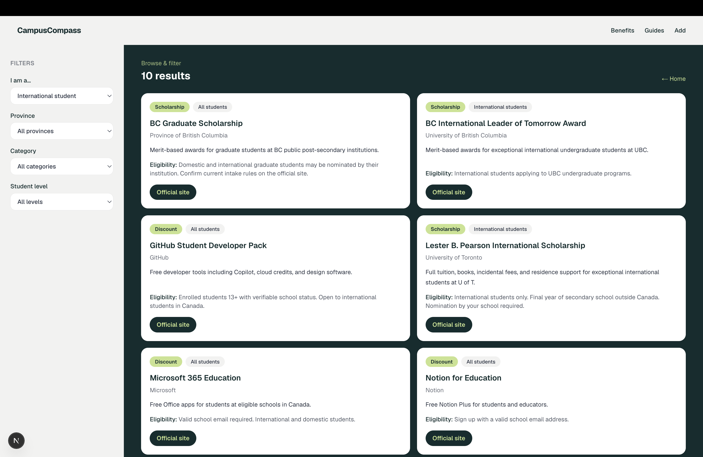

# CampusCompass

A full-stack web app that helps **international students in Canada** find scholarships, grants, discounts, and campus resources — filtered by province, category, and student level.

Built as a portfolio project to practice real app structure: domain logic, a database layer, REST API, and a UI wired end to end.

## Preview



## Features

- **Browse & filter** — narrow ~20 curated benefits by audience, province, category, and student type
- **REST API** — `GET /api/benefits` with validated query params; `POST /api/benefits` to add new ones
- **PostgreSQL + Prisma** — benefits stored in Neon (or any Postgres host)
- **Admin form** — add benefits at `/admin/add` without editing source files
- **JSON import** — bulk-load extras from `data/external-benefits.json`
- **Tested filter logic** — Vitest unit tests on the domain layer

## Tech stack

- **Next.js 16** (App Router) · **TypeScript** · **Tailwind CSS**
- **PostgreSQL** · **Prisma**
- **Zod** for API validation
- **Vitest** for unit tests

## Getting started

### Prerequisites

- Node.js 20+
- A free Postgres database ([Neon](https://neon.tech) works well)

### Setup

```bash
git clone https://github.com/vanshikaasharma/CampusCompass.git
cd CampusCompass
npm install
```

Copy the env file and add your database URL:

```bash
cp .env.example .env
# Edit .env and set DATABASE_URL=postgresql://...
```

Run migrations and seed the database:

```bash
npm run db:migrate
npm run db:seed
```

Start the dev server:

```bash
npm run dev
```

Open [http://localhost:3000](http://localhost:3000)

| Page | URL |
|------|-----|
| Home | `/` |
| Browse benefits | `/browse` |
| Add a benefit | `/admin/add` |

## Project structure

```
src/
  app/              # Pages and API routes
  components/       # UI (BenefitCard, SiteHeader)
  domain/           # Types + filterBenefits() — no DB imports here
  data/             # Repository pattern + seed data
  lib/              # Validations, API client, JSON import helpers
prisma/             # Schema, migrations, seed script
data/               # external-benefits.json for optional import
```

**Data flow**

```
seed / admin form / JSON import  →  Postgres  →  GET /api/benefits  →  /browse
```

## API

### `GET /api/benefits`

Optional query params (all have defaults):

| Param | Values |
|-------|--------|
| `studentAudience` | `international`, `domestic` |
| `province` | `ON`, `BC`, `AB`, `QC`, `national`, `all` |
| `category` | `scholarship`, `grant`, `discount`, `bursary`, `resource`, `all` |
| `studentType` | `college`, `university`, `grad`, `all` |

Example:

```
GET /api/benefits?studentAudience=international&province=ON&category=scholarship
```

### `POST /api/benefits`

Accepts a JSON body matching the admin form fields (`id`, `name`, `category`, `audience`, `provinces`, `provider`, `description`, `eligibilitySummary`, `applyUrl`, optional `studentTypes`).

## Adding benefits

Three ways to grow the list:

1. **Admin form** — `/admin/add` (saves directly to the database)
2. **Seed file** — edit `src/data/seed-benefits.ts`, then `npm run db:seed`
3. **JSON import** — edit `data/external-benefits.json`, then `npm run db:import`

Benefits are curated manually (official program pages, university sites, etc.) — not scraped from third-party discount apps.

## Scripts

| Command | What it does |
|---------|----------------|
| `npm run dev` | Start dev server |
| `npm run build` | Production build |
| `npm run test` | Run Vitest tests |
| `npm run db:migrate` | Apply Prisma migrations |
| `npm run db:seed` | Load seed benefits into DB |
| `npm run db:import` | Import from `external-benefits.json` |

## Deploying

Works on [Vercel](https://vercel.com) with one env var:

```
DATABASE_URL=your_neon_connection_string
```

After deploy, run `npm run db:seed` locally (it uses your `.env`) or seed from the Vercel/Neon dashboard so production has data.

## Notes

- The admin form has no login — fine for a portfolio demo; add auth before any real public launch.
- Benefit info can go out of date; always check the official `applyUrl` before applying.

## License

MIT
